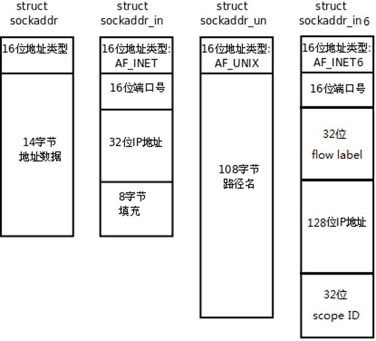
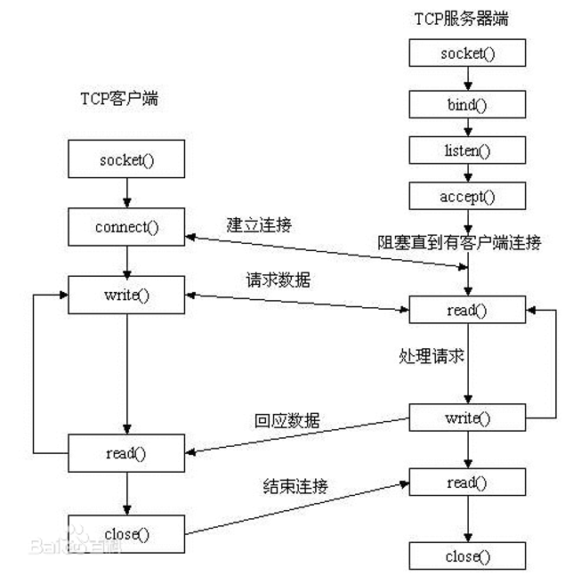

# 网络基础知识

## 0x01 基础知识

- 协议的定义
- OSI七层模型、TCP/IP模型
- 常见的两种设计模式
  - CS
  - P2P
- 以太网帧格式
- 字节序
- 常用的协议端口号以及处于哪一层
  - TCP
  - UDP
  - IP
  - ARP
  - FTP
  - HTTP
  - SMTP
  - SSH
  - ICMP
  - DNS

## 0x02 简单echo服务器

### 常用函数

- socket
- bind
- listen
- accept
- conncet
- recv
- sendto
- getsockopt
- setsockopt
- shutdown

### 常用结构体



### 服务器端开发流程

- 简单TCPecho服务器
- 简单UDPecho服务器

客户端开发流程

- 简单TCPecho客户端
- 简单UDPecho客户端




练习:

- 编写一个程序实现接受客户端连接并输出客户端的端口以及ip地址
- 编写一个程序实现将服务端端口改为复用

## 0x03包裹函数

可以直接下载unix网络编程的unp自行编译

## 0x04 多进程并发服务器

实现一个多进程服务器,要求:

- 允许多个客户端连接
- 父进程对sigchld信号自定义一个信号处理函数实现输出退出连接的客户段ip以及端口号

## 0x05 多线程并发服务器

## 0x06 多路IO服务器(重要)

### select

```c
使用select的开发服务端流程:
1 创建socket, 得到监听文件描述符lfd---socket()
2 设置端口复用-----setsockopt()
3 将lfd和IP  PORT绑定----bind()
4 设置监听---listen()
5 fd_set readfds;  //定义文件描述符集变量
  fd_set tmpfds;
  FD_ZERO(&readfds);  //清空文件描述符集变量
  FD_SET(lfd, &readfds);//将lfd加入到readfds集合中;
  maxfd = lfd;
  while(1)
  {
  	tmpfds = readfds;
  	nready = select(maxfd+1, &tmpfds, NULL, NULL, NULL);
  	if(nready<0)
  	{
  		if(errno==EINTR)//被信号中断
  		{
  			continue;
  		}
  		break;
  	}
  	
  	//有客户端连接请求到来
  	if(FD_ISSET(lfd, &tmpfds))
  	{
  		//接受新的客户端连接请求
  		cfd = accept(lfd, NULL, NULL);
  		
  		//将cfd加入到readfds集合中
  		FD_SET(cfd, &readfds);
  		
  		//修改内核监控的文件描述符的范围
  		if(maxfd<cfd)
  		{
  			maxfd = cfd;
  		}
  		
  		if(--nready==0)
  		{
  			continue;
  		}
  	}
  	
  	
  	//有客户端数据发来
  	for(i=lfd+1; i<=maxfd; i++)
  	{
  		if(FD_ISSET(i, &tmpfds))
  		{
			//read数据
  			n = read(i, buf, sizeof(buf));
  			if(n<=0)
  			{
  				close(i);
  				//将文件描述符i从内核中去除
  				FD_CLR(i, &readfds);
  			}
  			
  			//write应答数据给客户端
  			write(i, buf, n);
  		}
  		
		if(--nready==0)
  		{
  			break;
  		}
  	}
  	
  	close(lfd);
  	
  	return 0;
  }
 
```

练习:

编写一个select模型echo服务器

### poll

```c
使用poll模型开发服务端流程:
{
1 创建socket, 得到监听文件描述符lfd----socket()
2 设置端口复用----setsockopt()
3 绑定----bind()
4 监听----listen()
5 struct pollfd client[1024];
  client[0].fd = lfd;
  client[0].events = POLLIN;
  
  int maxi = 0;
  for(i=1; i<1024; i++)
  {
  	client[i].fd = -1;
  }
  
  while(1)
  {
  	nready = poll(client, maxi+1, -1);
  	//异常情况
  	if(nready<0)
  	{
  		if(errno==EINTR)  // 被信号中断
  		{
  			continue;
  		}
  		break;
  	}
  	
  	//有客户端连接请求到来
  	if(client[0].revents==POLLIN)
  	{
  		//接受新的客户端连接
  		cfd = accept(lfd, NULL, NULL);
  		
  		//寻找在client数组中可用位置
  		for(i=0; i<1024; i++)
  		{
  			if(client[i].fd==-1)
  			{
  				client[i].fd = cfd;
  				client[i].events = POLLIN;
  				break;
  			}
  		}
  		
  		//客户端连接数达到最大值
  		if(i==1024)
  		{
  			close(cfd);
  			continue;
  		}
  		
  		//修改client数组下标最大值
  		if(maxi<i)
  		{
  			maxi = i;
  		}
  		
  		if(--nready==0)
  		{
  			continue;
  		}
  	}
  	
  	//下面是有客户端发送数据的情况
  	for(i=1; i<=maxi; i++)
  	{
  		sockfd = client[i].fd;
  		//如果client数组中fd为-1, 表示已经不再让你内核监控了, 已经close了
  		if(client[i].fd==-1)
  		{
  			continue;
  		}
  		
  		if(client[i].revents==POLLIN)
  		{
  			//read 数据
  			n = read(sockfd, buf, sizeof(buf));
  			if(n<=0)
  			{
  				close(sockfd);
  				client[i].fd = -1;
  				
  			}
  			else 
  			{
  				//发送数据给客户端
  				write(sockfd, buf, n);
  			} 	
  			
	  		if(--nready==0)
	  		{
	  			break;
	  		}	
  		}  		
  	}  	
  }
 
  close(lfd); 
} 
  
```

练习:

编写一个pool模型的echo服务器

### epoll(重要)

```c
使用epoll模型开发服务器流程:
{
1 创建socket, 得到监听文件描述符lfd----socket()
2 设置端口复用----setsockopt()
3 绑定----bind()
4 监听----listen()
5 创建一棵epoll树
  int epfd = epoll_create();
	
  //将监听文件描述符上树
  struct epoll_event ev;
  ev.evetns = EPOLLIN;  //可读事件
  ev.data.fd = lfd;
  epoll_ctl(epfd, EPOLL_CTL_ADD, lfd, &ev);
  
  struct epoll_event events[1024];
  while(1)
  {
  	nready = epoll_wait(epfd, events, 1024, -1);
  	if(nready<0)
  	{
  		if(errno==EINTR)//被信号中断
  		{
  			continue;
  		}
  		break;
  	}
  	
  	for(i=0; i<nready; i++)
  	{
  		sockfd = events[i].data.fd;
  		//有客户端连接请求到来  	
  		if(sockfd==lfd)
  		{
  			cfd = accept(lfd, NULL, NULL);
  			
  			//将cfd对应的读事件上epoll树
  			ev.data.fd = cfd;
  			ev.evetns = EPOLLIN; 
  			epoll_ctl(epfd, EPOLL_CTL_ADD, cfd, &ev);
  			continue;
  		}
  		
  		//有客户端发送数据过来
  		n = Read(sockfd, buf, sizeof(buf));
  		if(n<=0)
  		{
  			close(sockfd);
  			//将sockfd对应的事件节点从epoll树上删除
  			epoll_ctl(epfd, EPOLL_CTL_DEL, sockfd, NULL);
  			perror("read error or client closed");
  			continue;
  		}
  		else 
  		{
  			write(sockfd, buf, n);
  		}
  	} 
  }
  
  Close(epfd);
  close(lfd);
  
  return 0;
}
```

### epoll的两种工作模式

- ET
- LT

### epoll反应堆

epoll反应堆的核心思想是: 在调用epoll_ctl函数的时候, 将events上树的时候,利用epoll_data_t的ptr成员, 将一个文件描述符,事件和回调函数封装成一个结构体, 然后让ptr指向这个结构体, 然后调用epoll_wait函数返回的时候, 可以得到具体的events, 然后获得events结构体中的events.data.ptr指针, ptr指针指向的结构体中有回调函数, 最终可以调用这个回调函数.

练习:

编写一个epool模型的echo服务器

## 0x07 本地套接字

练习:本地套接字实现两个进程通信

