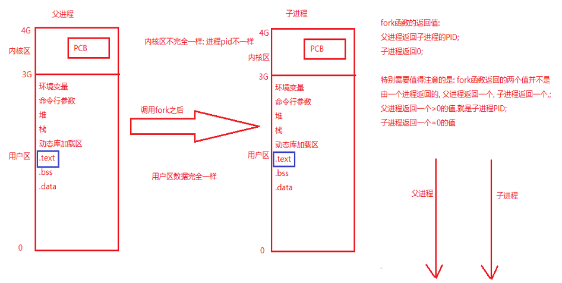
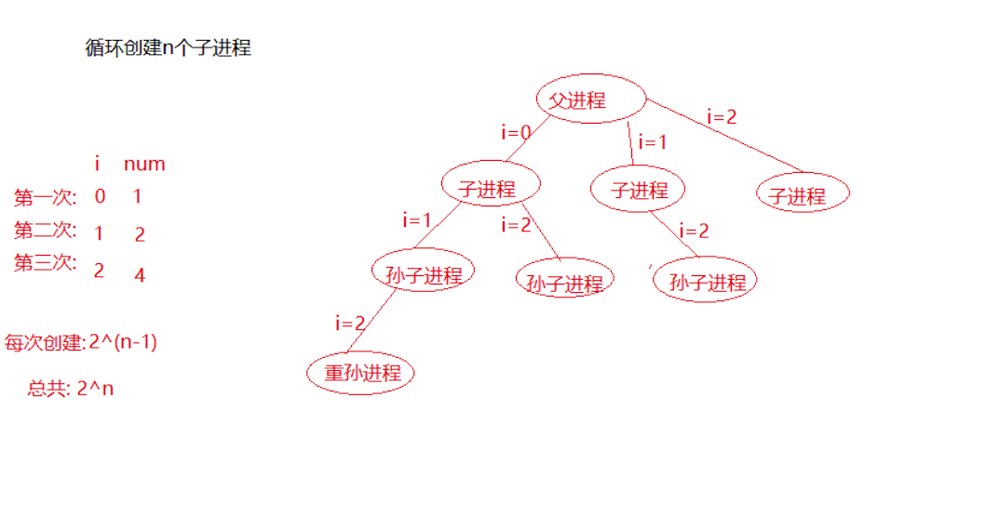
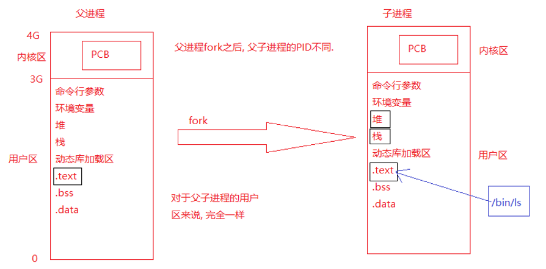

# 预备知识

## 0x01文件相关

### 文件描述符相关(重点)

- open函数
- close函数
- write函数
- read函数
- lseek函数
- dup\dup2函数
- fcntl函数

```c
//fcntl函数常用的操作:

//1复制一个新的文件描述符:
int newfd = fcntl(fd, F_DUPFD, 0);
//2获取文件的属性标志
int flag = fcntl(fd, F_GETFL, 0)
//3设置文件状态标志
flag = flag | O_APPEND;
fcntl(fd, F_SETFL, flag)

//4常用的属性标志
O_APPEND-----设置文件打开为末尾添加
O_NONBLOCK-----设置打开的文件描述符为非阻塞

```

- perror函数

### 文件目录相关(非重点)

- stat、lstat函数及其区别
- opendir函数
- readdir函数
- closedir函数

读取目录一般操作

```c
 DIR *pDir = opendir(“dir”);   //打开目录
 while((p=readdir(pDir))!=NULL){
   //循环读取文件
 }  
 closedir(pDir);  //关闭目录

```

## 0x02进程

### 进程的基本概念

- 程序进程的区别

- 并行并发区别

- PCB进程控制块:usr/src/linux-headers-4.4.0-96/include/linux/sched.h之中的struct task_struct结构体

  - 进程id
  - 进程状态

- 创建进程时内核的操作

  

### 进程相关函数(重点)

- fork函数
- ps命令和kill函数
- getpid/getppid

思考题:

1. 如何循环生成n个子进程,并且这些子进程均为兄弟关系

   下面两个代码产生的进程有什么区别,函数输出均为:自己的pid和父亲进城的pid

```c
#include <stdio.h>
#include <stdlib.h>
#include <string.h>
#include <sys/types.h>
#include <unistd.h>

int main()
{
	int i = 0;
	for(i=0; i<3; i++)
	{
		//创建子进程
		pid_t pid = fork();
		if(pid<0) //fork失败的情况
		{
			perror("fork error");
			return -1;
		}
		else if(pid>0)//父进程
		{
			printf("father: pid==[%d], fpid==[%d]\n", getpid(),getppid());
			//sleep(1);
		}
		else if(pid==0) //子进程
		{
			printf("child: pid==[%d], fpid==[%d]\n", getpid(), getppid());
		}
	}


```

```c
#include <stdio.h>
#include <stdlib.h>
#include <string.h>
#include <sys/types.h>
#include <unistd.h>

int main()
{
	int i = 0;
	for(i=0; i<3; i++)
	{
		//创建子进程
		pid_t pid = fork();
		if(pid<0) //fork失败的情况
		{
			perror("fork error");
			return -1;
		}
		else if(pid>0)//父进程
		{
			printf("father: pid==[%d], fpid==[%d]\n", getpid(),getppid());
			//sleep(1);
		}
		else if(pid==0) //子进程
		{
			printf("child: pid==[%d], fpid==[%d]\n", getpid(), getppid());
			break;
		}
	}

	//第1个子进程
	if(i==0)
	{
		printf("[%d]--[%d]: child\n", i, getpid());	
	}

	//第2个子进程
	if(i==1)
	{
		printf("[%d]--[%d]: child\n", i, getpid());	
	}
	//第3个子进程
	if(i==2)
	{
		printf("[%d]--[%d]: child\n", i, getpid());	
	}
	//父进程
	if(i==3)
	{
		printf("[%d]--[%d]: child\n", i, getpid());	
	}
	sleep(10);

	return 0;
}


```

可以使用一张图来形象地描述二者的不同,第一段代码的实际运行结果是这样的:

而第二段代码由于子进程直接break退出循环,因此只有父进程执行了创建进程这一条语句,真正产生了n个互为兄弟的子进程

2. 父子进程能否共享全局变量?

   自己编写代码验证一下:读时共享,写时复制

3. 父子进程是否共享文件描述符,是否共享文件偏移量

   自己编写代码验证共享文件描述符,不共享文件偏移量

###  进程回收(重点)

- wait函数

- waitpid函数(更实用)

  

### exec函数族

- execl函数
- execlp函数

练习:csapp的终端lab

实现原理:



## 0x03进程间通信(重要)

- 管道
- FIFO
- 内存映射区

## 0x04信号量(重要)

- 信号的三种状态:产生、未决、递达

- 信号的处理方式:默认动作、忽略、捕捉
- 阻塞信号集未决信号集
- 信号四要素:
  - 编号
  - 名称
  - 事件
  - 处理动作

### 相关函数

- signal函数
- kill函数
- abort函数
- settimeer函数

练习:

- 编写程序,电脑1秒种能数多个数字
- 编写程序,使用settimer每隔1s输出一行字符串

### 信号集相关

信号集相关函数

- sigemptyset函数
- sigfillset函数
- sigdelset函数
- sigismember函数
-  sigprocmask函数
- sigpending函数

练习:

- 编写程序，设置阻塞信号集并把所有常规信号的未决状态打印至屏幕

### 信号捕捉函数(重要)

- signal函数
- sigaction函数

练习:

- 编写程序，使用sigaction函数注册信号捕捉函数，并使用这个程序验证信号不支持排队

### sigchld函数(重要)

- 产生sigchld函数的条件
  - 子进程结束
  - 子进程收到sigstop
  - 子进程停止时收到了sigcont信号

练习：

- 父进程创建三个子进程，然后让父进程捕获SIGCHLD信号完成对子进程的回收。

注意点：

- 有可能还未完成信号处理函数的注册三个子进程都退出了。解决办法：可以在fork之前先将SIGCHLD信号阻塞，当完成信号处理函数的注册后在解除阻塞。
- 当SIGCHLD信号函数处理期间, SIGCHLD信号若再次产生是被阻塞的,而且若产生了多次, 则该信号只会被处理一次, 这样可能会产生僵尸进程。 解决办法: 可以在信号处理函数里面使用while(1)循环回收, 这样就有可能出现捕获一次SIGCHLD信号但是回收了多个子进程的情况，从而可以避免产生僵尸进程


## 0x05线程(重要)

### 线程基本概念

- 线程与进程的联系与区别
- 线程共享的资源以及不共享的资源
- 线程的底层实现

### 线程相关的函数

- pthread_create函数
- pthread_exit函数
- pthread_join函数
- pthread_detach函数
- pthread_cancel函数
- pthread_equal函数

练习:

- 编写程序创建一个线程，并给线程传递一个int参数

- 编写程序，主线程循环创建5个子线程，并让子线程判断自己是第几个子线程并输出

- 编写程序测试pthread_exit函数分别在主线程和子线程调用会使那些线程退出

- 编写程序，使主线程获取子线程的退出状态(一般先定义void *ptr; 然后pthread_join(threadid, &ptr);)

- 编写程序，在创建线程之后设置线程的分离状态(PS：如果线程已经设置了分离状态，则再调用pthread_join就会失败，可用这个方法验证是否已成功设置分离状态)

- 编写程序，让主线程取消子线程的执行

  PS:线程的取消并不是实时的，而有一定的延时。需要等待线程到达某个取消点(检查点).通常是一些系统调用creat、open、pause、close、read、write..... 执行命令man 7 pthreads可以查看具备这些取消点的系统调用列表。可粗略认为一个系统调用(进入内核)即为一个取消点.

### 线程同步

- 线程同步的概念
- 解决同步问题的方法
  - 原子操作
  - 互斥锁

互斥锁函数

- pthread_mutex_init函数
- pthread_mutex_destroy函数
- pthread_mutex_lock函数
- pthread_mutex_unlock函数
- pthread_mutex_trylock函数

练习:通过线程同步自行实现生产者消费者或者读写者问题