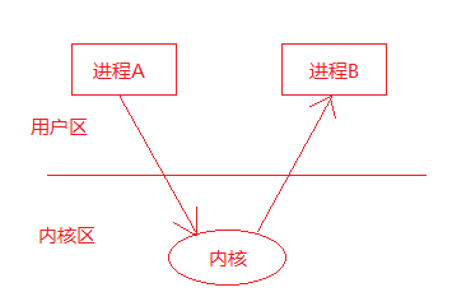

# 信号基本概念

- 信号的概念

  信号是信息的载体，Linux/UNIX 环境下，古老、经典的通信方式， 现下依然是主要的通信手段。

-  信号的特点
  - 简单
  - 不能携带大量信息
  - 满足某个特点条件才会产生

## 信号的机制

进程A给进程B发送信号，进程B收到信号之前执行自己的代码，收到信号后，不管执行到程序的什么位置，都要暂停运行，去处理信号，处理完毕后再继续执行。与硬件中断类似——异步模式。但信号是软件层面上实现的中断，早期常被称为“软中断”

**每个进程收到的所有信号，都是由内核负责发送的。**

进程A给进程B发送信号示意图：

## 信号的状态

信号有三种状态：产生、未决和递达。

- 信号的产生
  - 按键产生，如：Ctrl+c、Ctrl+z、Ctrl+\
  - 系统调用产生，如：kill、raise、abort
  - 软件条件产生，如：定时器alarm
  - 硬件异常产生，如：非法访问内存(段错误)、除0(浮点数例外)、内存对齐出错(总线错误)
  - 命令产生，如：kill命令
- 未决：产生和递达之间的状态。主要由于阻塞(屏蔽)导致该状态。 
- 递达：递送并且到达进程。

## 信号的处理方式

- 执行默认动作 
- 忽略信号(丢弃不处理)
-  捕捉信号(调用用户的自定义的处理函数)

## 特质

信号的实现手段导致信号有很强的**延时性**，但对于用户来说，时间非常短，不易察觉。