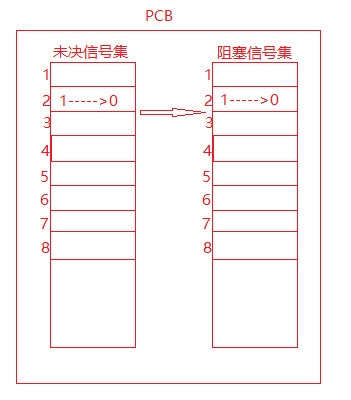

# 未决信号集和阻塞信号集

阻塞信号集是当前进程**要阻塞的信号的集合（暂时先不进行处理的信号）**，未决信号集是当前进程中还处于**未决状态的信号的集合(即没有被处理的信号)**，这**两个集合存储在内核的PCB中**

下面以SIGINT为例说明信号未决信号集和阻塞信号集的关系：

当进程收到一个SIGINT信号（信号编号为2），首先这个信号会保存在未决信号集合中，此时对应的2号编号的这个位置上置为1，表示处于未决状态；在这个信号需要被处理之前首先要在阻塞信号集中的编号为2的位置上去检查该值是否为1：

- 如果为1，表示SIGNIT信号被当前进程阻塞了，这个信号暂时不被处理，所以未决信号集上该位置上的值保持为1，表示该信号处于未决状态；
- 如果为0，表示SIGINT信号没有被当前进程阻塞，这个信号需要被处理，内核会对SIGINT信号进行处理（执行默认动作，忽略或者执行用户自定义的信号处理函数），并将未决信号集中编号为2的位置上将1变为0，表示该信号已经处理了（即已经递达了），这个时间非常短暂，用户感知不到。

当SIGINT信号从阻塞信号集中解除阻塞之后，该信号就会被处理。

## 信号集相关函数

首先对未决信号集和阻塞信号集无法直接进行操作

- int sigemptyset(sigset_t *set);
  - 函数说明：将某个信号集清0          
  - 函数返回值：
    - 成功：0；
    - 失败：-1，设置errno
- int sigfillset(sigset_t *set);
  - 函数说明：将某个信号集置1             
  - 函数返回值：
    - 成功：0；
    - 失败：-1，设置errno
- int sigaddset(sigset_t *set, int signum); 
  - 函数说明：将某个信号加入信号集合中
  - 函数返回值：成功：0；失败：-1，设置errno
- int sigdelset(sigset_t *set, int signum);     
  - 函数说明：将某信号从信号清出信号集     
  - 函数返回值：成功：0；失败：-1，设置errno
-  int sigismember(const sigset_t *set, int signum);
  - 函数说明：判断某个信号是否在信号集中
  - 函数返回值：
    - 在：1；
    - 不在：0；
    - 出错：-1，设置errno
-  sigprocmask函数
  - 函数说明：用来屏蔽信号、解除屏蔽也使用该函数。其本质，读取或修改进程控制块中的信号屏蔽字（阻塞信号集）。特别注意，屏蔽信号只是将信号处理延后执行(延至解除屏蔽)；而忽略表示将信号丢弃处理。
  - 函数原型：int sigprocmask(int how, const sigset_t *set, sigset_t *oldset);
  - 函数返回值：
    - 成功：0；
    - 失败：-1，设置errno
  -  函数参数：
    - how参数取值：假设当前的信号屏蔽字为mask
    - SIG_BLOCK: 当how设置为此值，set表示需要屏蔽的信号。**相当于** mask = mask|set
    - SIG_UNBLOCK: 当how设置为此，set表示需要解除屏蔽的信号。相当于 mask = mask & ~set
    - SIG_SETMASK: 当how设置为此，set表示用于替代原始屏蔽及的新屏蔽集。相当于mask = set若，调用sigprocmask解除了对当前若干个信号的阻塞，则在sigprocmask返回前，至少将其中一个信号递达
    - set：传入参数，是一个自定义信号集合。由参数how来指示如何修改当前信号屏蔽字
    - oldset：传出参数，保存旧的信号屏蔽字。
- sigpending函数
  - 函数原型：int sigpending(sigset_t *set);     
  - 函数说明：读取当前进程的未决信号集
  - 函数参数：set传出参数
  - 函数返回值：成功：0；失败：-1，设置errno

