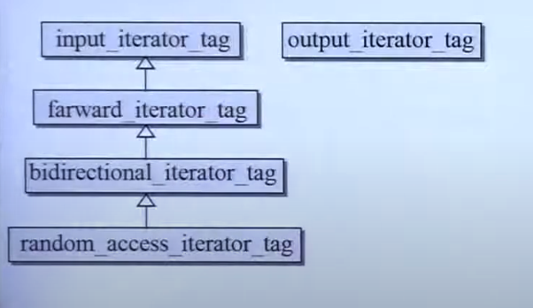

# iterator

iterator共有五种，分别为`input_iterator_tag`，`output_iterator_tag`，`forward_iterator_tag`，`bidirection_iterator_tag`，`random_iterator_tag`

代码如下所示：

```c++
struct input_iterator_tag {};
struct output_iterator_tag {};
struct forward_iterator_tag : public input_iterator_tag {};
struct bidirectional_iterator_tag : public forward_iterator_tag {};
struct random_access_iterator_tag : public bidirectional_iterator_tag {};

```



